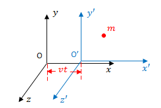
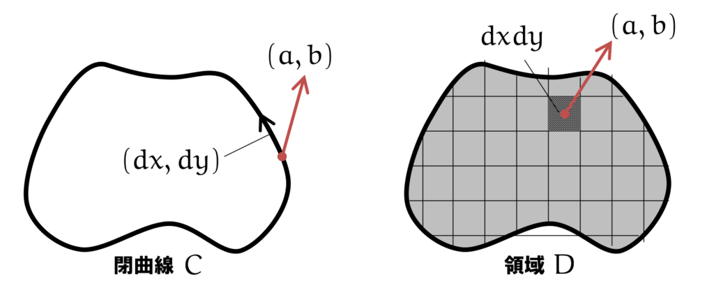

# 力学入門
## ~ニュートン力学から量子力学まで~
---

# ニュートン力学

--

## 運動の法則

1. 慣性の法則
1. 運動方程式
1. 作用・反作用の法則

--

## 第一法則：慣性の法則
すべての物体は、外部から力を加えられない限り、静止している物体は静止状態を続け、運動している物体は等速直線運動を続ける
--

## 第二法則：運動方程式
位置を$x:\mathbb{R}\to\mathbb{R}^3$, 力を$F:\mathbb{R}\to\mathbb{R}^3$, 質量を$m\in\mathbb{R}^+$とすると, 次式が成立する. 
$$
 m\frac{d^2x}{dt^2}(t)=F(t)
$$
物理では慣例的に時間の微分を上付きドットで表現する. (そして時間の引数を省略することもある)
$$
m\ddot{x} = F
$$
--

ここで$F=0$という条件を考えると
$$
\ddot{x} = 0 \Rightarrow \dot{x} = \mathrm{const.}
$$
となる. よって慣性の法則は運動方程式の特別な例であることがわかる. 

--

### 発展：なぜわざわざ別の法則になっているのか？
位置$x(t)$は観測者がどの位置にいるか, またどう動いているかによって観測される値は異なる.

  

一般に, 静止または等速で運動する観測者から見た系を**慣性系**と呼ぶ. 
--

慣性系$O=(t, x)$と, $t=0$で同じ位置にいて$O$から見て相対速度$v\in\mathbb{R}^3$で等速直線運動する慣性系$O'=(t', x')$との関係は

$$
    \left(
    \begin{array}{cc}
        t'  \\\\
        x' 
    \end{array}
    \right)=
    \left(
    \begin{array}{cc}
        1 & 0  \\\\
        -v & 1 
    \end{array}
    \right)
    \left(
    \begin{array}{cc}
        t  \\\\
        x 
    \end{array}
    \right)
$$
で表現することができる. このような慣性系同士の変換を**ガリレイ変換**と呼ぶ. 

--

ガリレイ変換によって$(t, x)\to(t', x')$という変換を考えるとき変換後の慣性系での運動方程式は
$$
\begin{split}
m\ddot{x}(t) = F(t)　\\\\
\Longleftrightarrow m\frac{d^2}{dt^2}\left(x'(t')+vt\right) = F(t) \\\\
\Longleftrightarrow m\ddot{x}'(t') = F(t')
\end{split}
$$
したがって**ある慣性系と別の慣性系は同じ形の運動方程式となる**. 任意の慣性系で同じ物理法則が成り立つという性質を
**ガリレイの相対性原理**と呼ぶ. 

--

#### ニュートン力学はガリレイ変換に不変

  

慣性系同士はガリレイ変換によって移り変わることができ, 慣性系では運動方程式が成立する. すなわち, **一つでも慣性系が存在していれば**全ての慣性系で運動方程式が成立する. 慣性の法則はそのような慣性系が存在することを主張している. 
--

#### 観測者が加速度運動している場合
慣性系から観測者が速度$v(t)$で加速度運動している場合の座標変換は
$$
    \begin{split}
    t' &= t \\\\
    x' &= x - \int^t_0v(s)ds
    \end{split}
$$
※$\dot{v}\equiv0$でガリレイ変換に帰着することに注意
--

慣性系から一般の非慣性系における運動方程式の変換は
$$
\begin{split}
m\ddot{x}(t) = F(t)　\\\\
\Longleftrightarrow m\frac{d^2}{dt^2}\left(x'(t')+\int^t_0v(s)ds\right) = F(t) \\\\
\Longleftrightarrow m\ddot{x}'(t') = F(t') - m\dot{v}(t')
\end{split}
$$

加速度運動する系では$m\dot{v}$という力が発生する. この力を**慣性力**と呼ぶ. 
(e.g., 遠心力, コリオリ力, 電車や車で急発進/急停止したときに車内で感じる力)

--

## 第三法則：作用・反作用の法則

物体が相互作用するとき, その力の向きは互いに反対で大きさは等しい.

$$
F_{A\to B} = F_{B\to A}
$$

e.g., 地球が月を引っ張るとき, 月もまた同じ力で地球を引っ張っている. 

---

# 保存則

--

## 力学的エネルギー

運動方程式の両辺に速度をかける
$$
m\ddot{x}\cdot\dot{x} = F\cdot\dot{x}
$$

--

- 左辺 
$$m\ddot{x}\cdot\dot{x} = \frac{d}{dt}\left(\frac{1}{2}m||\dot{x}||^2\right)$$
- 右辺
$$
\begin{split}
F\cdot\dot{x} &= \frac{d}{dt}\left(\int^t_0F(s)\cdot\dot{x}(s)ds\right) \\\\
&= \frac{d}{dt}\left(\int_{C(t)}F\cdot dx\right)
\end{split}
$$

--

### 力学的エネルギー保存則
$$
\frac{d}{dt}\left(\frac{1}{2}m||\dot{x}||^2-\int_{C(t)}F\cdot dx\right)=0
$$
第一項を**運動エネルギー**, 第二項を**仕事**と呼ぶ.

--

仕事は一般に経路によって値が変わる. 

とくに, 仕事が経路によらない力のことを**保存力**という. 

保存力にはどのような性質があるだろうか. 

--

始点と終点が同じ任意の経路$C_1$, $C\_2$による仕事が等しいとする.

$$
\begin{split}
\int_{C\_1}F\cdot dx &= \int_{C\_2}F\cdot dx \\\\
\\\\
\Leftrightarrow\oint F\cdot dx &= 0
\end{split}
$$

--

  

ストークスの定理より

$$
\oint F\cdot dx =\int_S \left(\nabla\times F\right)\cdot dS = 0
$$

$\nabla\times F\equiv 0$とするには
$
F\propto \nabla U
$

という形に定まる. ($U:\mathbb{R}^3\to\mathbb{R}$)

--

$F=-\nabla U$の場合仕事は

$$
\int_{C(t)}F\cdot dx　= U(x(0)) - U(x(t))
$$

したがって, エネルギー保存則は以下のようになる.

$$
\frac{1}{2}m||\dot{x}||^2 + U(x) = \mathrm{const.}
$$

$U(x)$を**ポテンシャルエネルギー**と呼ぶ. 

--

## 運動量
運動方程式を両辺時間で積分する. 
$$
\begin{split}
\int\^{t\_1}\_{t_0}F(s)ds &= m\int\^{t\_1}\_{t\_0}\ddot{x}(s)ds \\\\
&=m\dot{x}(t_1) - m\dot{x}(t_0)
\end{split}
$$
右辺各項を**運動量**, 左辺を**力積**と呼ぶ. 

--

とくに$F\equiv 0$の時は
$$\frac{d}{dt}\left(m\dot{x}\right)=0$$

これを**運動量保存則**と呼ぶ. 

---

# 1次元調和振動子
古典論で解いてみる

--

  

調和振動子とは, 滑らかな床にある質量$m$の質点を, バネ定数$k$のバネで壁とつないだ系のことである. 
バネは自然長から$x$だけ離れたとき, 質点には
$$
F=-kx=-\frac{d}{dx}\left(\frac{1}{2}kx^2\right)
$$
なる力が働く. (フックの法則)

---

# 演習課題：万有引力とケプラーの法則

---

# 前期量子論
---

# 波動力学
---

# 行列力学
---

# ディラックの記法